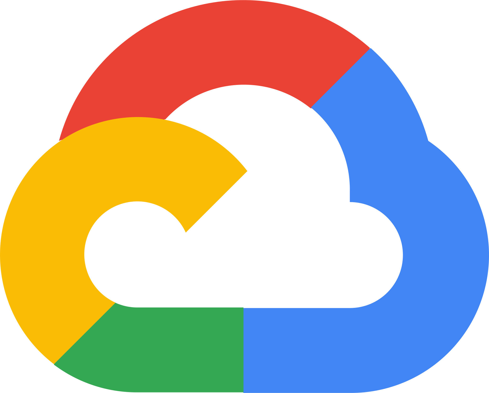
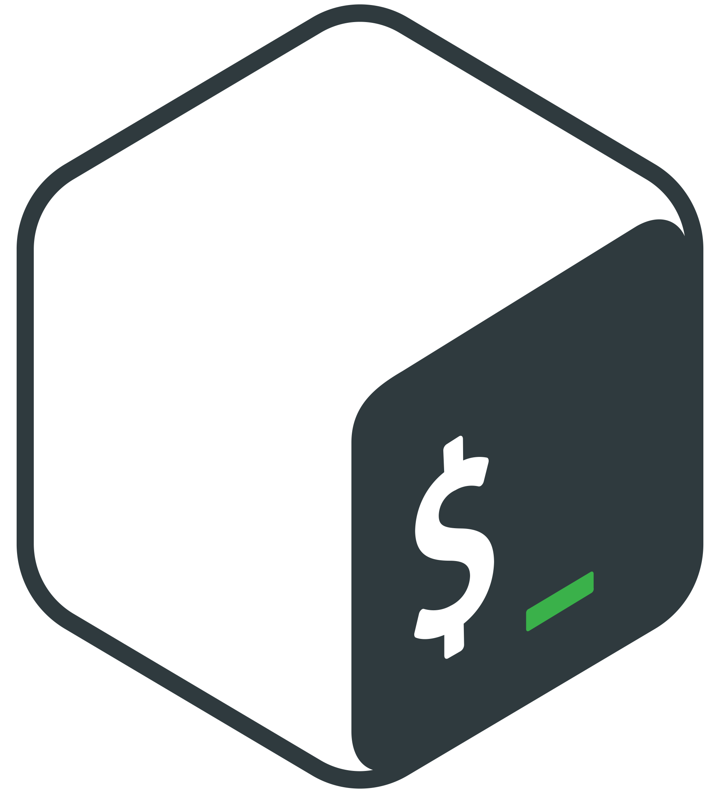
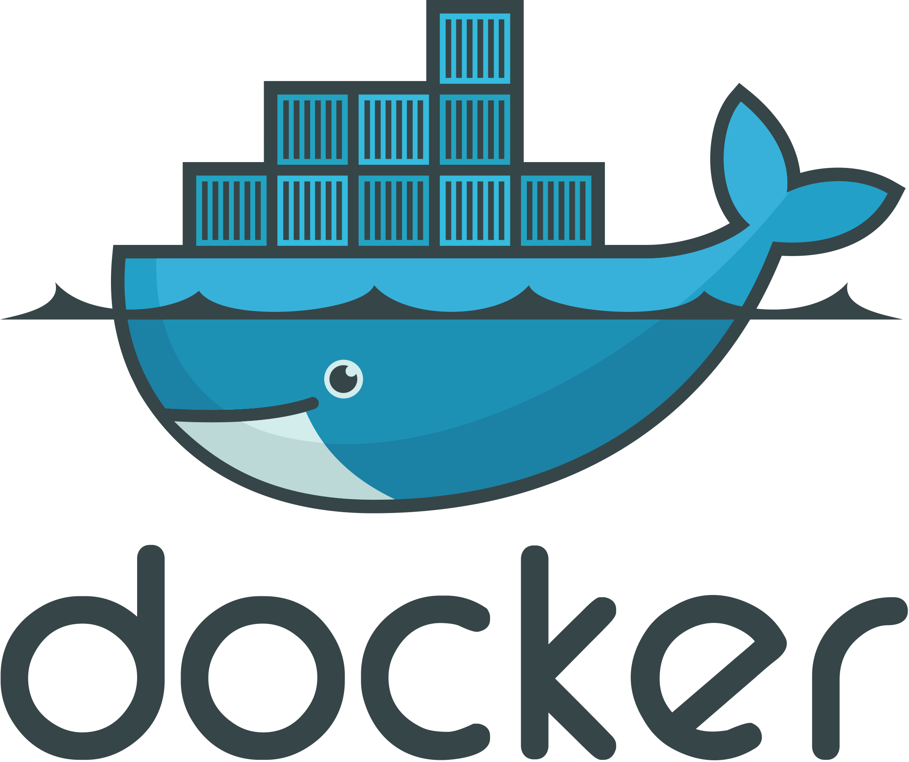
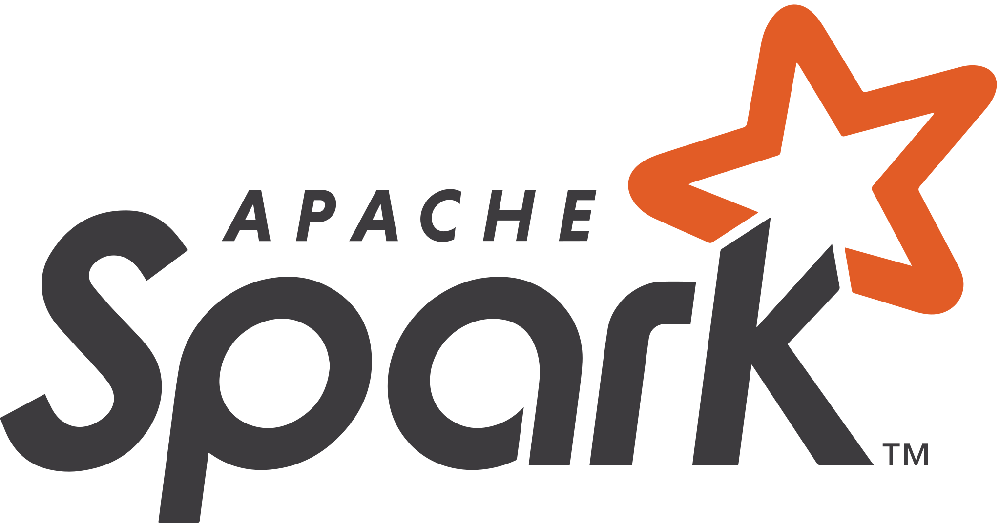

<!-- 

Um cara apaixonado pelo mundo dos dados!!!

A guy passionate about the world of data!!!
-->

## Olá, bem-vindo ao meu GitHub!

&nbsp;&nbsp;
&nbsp;&nbsp;
&nbsp;&nbsp;
&nbsp;&nbsp;

---

Sou um profissional com vasta experiência em desenvolvimento de software, com foco no <strong><a href="https://www.totvs.com/sistema-de-gestao">ERP Microsiga Protheus</a> da TOTVS</strong>, ajudando empresas a estruturar, otimizar e transformar dados em soluções práticas e eficientes.

Trabalho com tecnologia desde 1991, atuando ao longo dos anos em áreas como infraestrutura, redes, desenvolvimento e, mais recentemente, Business Intelligence e Engenharia de Dados.

Ao longo da minha trajetória, percebi que grande parte do meu trabalho envolvia <strong>estruturar dados e entregar informações estratégicas para apoiar a gestão de negócios</strong>. Isso me levou a aprofundar meus conhecimentos em <strong>banco de dados relacionais e NoSQL, Power BI, integração de dados e engenharia de dados</strong>.

🎯 Atualmente, meu foco está em <strong>Engenharia de Dados</strong>,  com interesse crescente em plataformas como <strong>Databricks</strong>, práticas modernas de <strong>DataOps</strong>, e a construção de pipelines escaláveis e automatizados. Busco atuar com tecnologias que conectam dados a decisões reais, com qualidade, governança e performance.

Adoro aprender e compartilhar o que venho construindo, e esse foi um dos motivos para criar essa conta no GitHub.

## Tecnologias e Ferramentas

## Preferências

<!---->

## Linguagens mais usadas  

  

  

## Aprendendo

<!---->
<!---->

<!---->

## Conquistas Google Cloud

Durante minha transição para Engenharia de Dados, venho me dedicando a laboratórios práticos na plataforma <strong>Google Cloud Skills Boost</strong>, com foco em fundamentos de computação em nuvem, manipulação de dados e machine learning aplicado.

### 🏅 Badges conquistados:
- **Engineer Data for Predictive Modeling with BigQuery ML**  
- **Prepare Data for ML APIs on Google Cloud**  
- **Google Cloud Computing Foundations: Data, ML, and AI in Google Cloud**  
- **Google Cloud Computing Foundations: Networking & Security in Google Cloud**  
- **Google Cloud Computing Foundations: Infrastructure in Google Cloud**  
- **Google Cloud Computing Foundations: Cloud Computing Fundamentals – Locales**  
- **Google Cloud Essentials**  

🔗 [Acesse meus badges públicos aqui](https://www.cloudskillsboost.google/public_profiles/162923d9-bcd0-49bb-afbf-0a19a5065db5)

<!--
-- Icons
https://worldvectorlogo.com/
https://devicon.dev/
https://shields.io/
https://badges.pages.dev/

-- Shields.io Badges
https://simpleicons.org/
https://github.com/simple-icons/simple-icons/blob/master/slugs.md

-->
